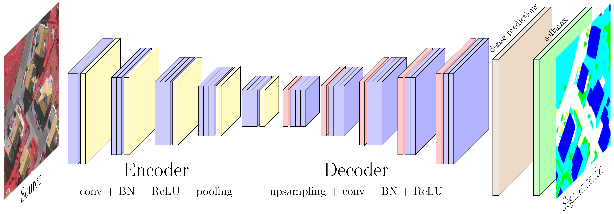
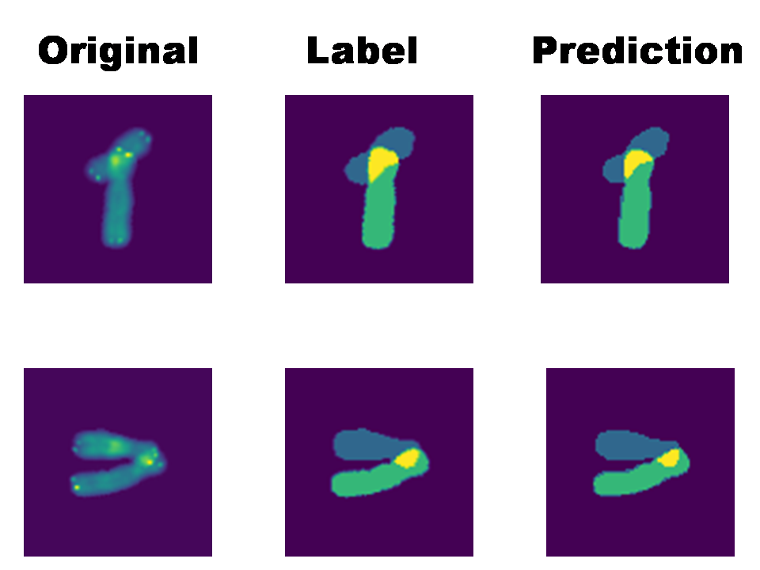
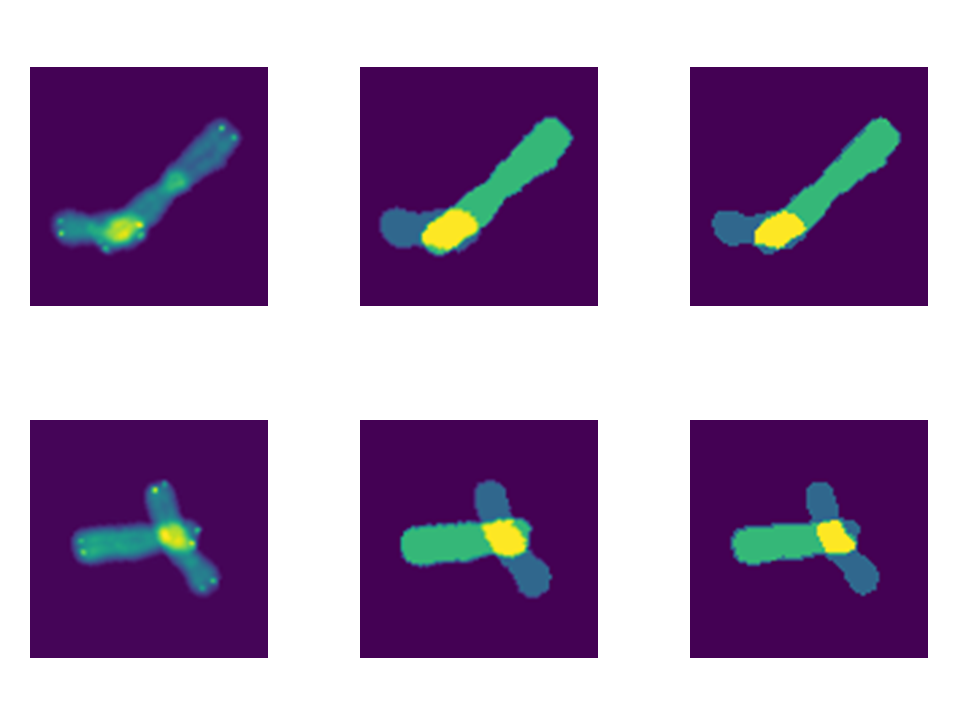
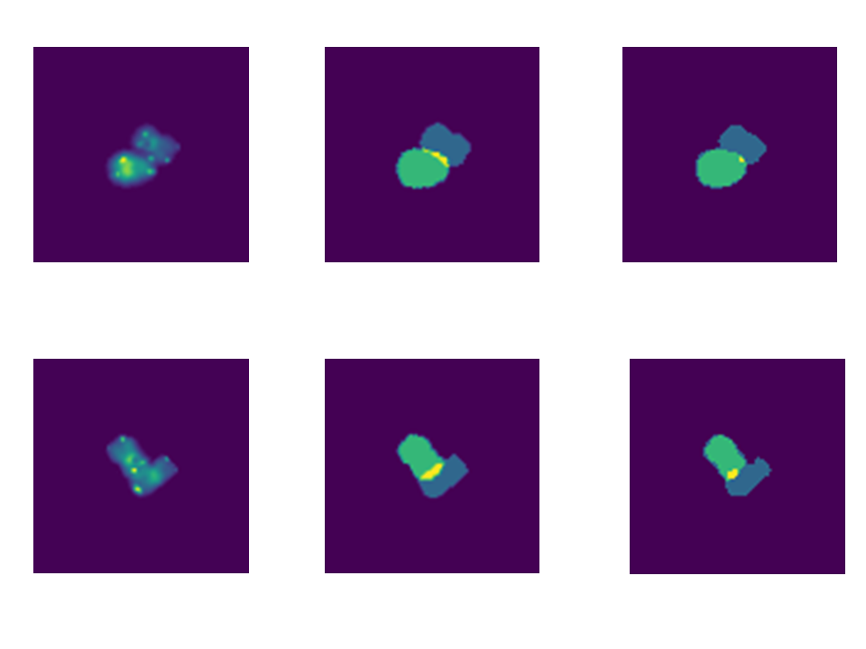

# SegNet---Chromosome

## Introduction

Visualizing chromosomes is important for  many  for  medical  diagnostic  problems,  but  chromosomes  often  overlap  and  it  is necessary to identify and distinguish between the overlapping chromosomes.  This fast and fully-automated segmentation solution allows to scale certain experiments to very large number of chromosomes.

## Dependencies

- Keras with TensorFlow backend
- Numpy
- Matplotlib
- OS
- Scikit-Image
- H5py

## Overview

Cytogenetics is the study of cells, more so chromosomes and their structure and changes. 
The importance of separating overlapping chromosomes can be understood in terms of the orders of difficulty involved in manually segmenting them.
In cytogenetics, experiments typically starts from chromosomal preparations fixed on glass slides. Occasionally a chromosome can fall on another one,
 yielding overlapping chromosomes in the image. 

Automatic segmentation methods can be used to overcome this problem.

## Model

SegNet is a convolutional neural network used for semantic pixel wise labeling. This is commonly known as semantic segmentation which means that the network 
learns to assign each pixel a class depending on the object or surface it belongs, e.g a car, highway, tree, building. It uses an Encoder-Decoder architecture, 
where the image is first downsampled by an encoder as in a "traditional" CNN like VGG, and then it is upsampled by using a decoder that is like a reversed CNN,
with upsampling layers instead of pooling layers. 
SegNet has significantly fewer parameters compared to the state-of-the-art model at the time (because those models relied on the fully connected layers from 
the pre-trained networks) from 134M parameters to 14.7M, while giving better results on some benchmarks.

## Data

A Kaggle dataset is used for the project, it consists of  13434 images and ground truths in h5 format.
The images are resized to 88x88 from the original size of 94x93. Ground truths are the segmentation masks of the input images. Training set consists of 
the whole dataset except the last 20 images with 5% validation split.

## Training

The model was trained using adam optimizer for an hour on colab GPU. Since the resolution is low, the model is prone to overfitting and was not giving good results on
the test set. So dropout layes are added after every block. To further ensure that the model does not overfit, EarlyStopping callback of Keras is used. The training 
automatically stopped after the 9th epoch.

## Results

In the segmentation map, 4 colors are present corresponding to  the background,  non-overlapping regions of one chromosome,  non-overlapping regions of the second chromosome and overlapping regions.
Some of the results are shown below:

## References

- Original paper: [Arxiv](https://arxiv.org/abs/1511.00561)
- Image taken from:  [Vehicle Detection and Classification through Semantic Segmentation of Aerial Images](http://www.mdpi.com/2072-4292/9/4/368/htm)
- Original Dataset: [Kaggle](https://www.kaggle.com/jeanpat/overlapping-chromosomes)
